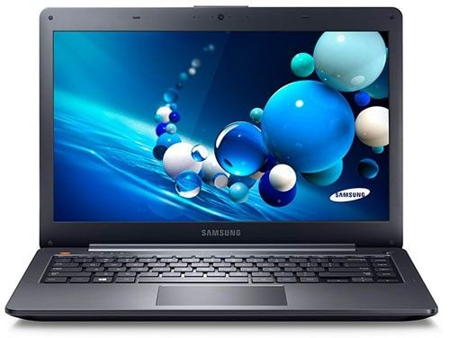

# Hackinstoh ATIV Book NP270E4E-KDWBR

---

| | |
| ------ | ------ |
| .jpg) |   |

| |Column 1 |Column 2 |
|---|---|
 Fabricante | Samsung |
|  Modelo | NP270E4E-KD1BR |
|   GPU |  Intel HD Graphics 4000 1536MB |
|   CPU |  Intel Core i3-3110M |

## Funcionalidades

---

- [x] Slepp

- [x] Touch Pad

### Referências

* [Dell Vostro 3460 Hackintosh](https://github.com/qilskcter/Dell-Vostro-3460-Hackintosh)

* [Youtube: Fazendo funcionar o seu touchpad e teclado...](https://www.youtube.com/watch?v=X96VWxQzy_s)